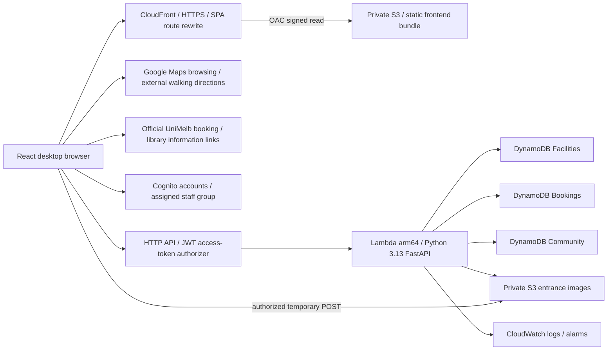

# SYAS infrastructure and Python handoff

This delivery prepares AWS infrastructure. It does **not** implement the Python API, create AWS stacks, publish a hosted application, provision Google Maps credentials, or claim real cloud integration. The desktop uses explicit local demo services. A future production adapter must fail closed when its configuration is absent.

## Architecture



Two native templates live in `infra/`:

- `bootstrap.yaml`: separate retained artifact and frontend buckets with versioning, encryption, public-access blocks, and TLS requirements; CloudFront distribution; Origin Access Control (OAC); a viewer-request SPA rewrite function; cache policy; and hosting-origin outputs.
- `application.yaml`: retained Cognito user pool; browser client without a secret; assigned staff group; three retained on-demand/PITR tables; private/versioned media bucket; Python Lambda; bounded IAM role; explicit routes; HTTP API JWT authorizer; log groups; error/latency alarms.

Regional resources default to Sydney (`ap-southeast-2`); CloudFront is global. Choose a separate stack name and bootstrap for each environment. Template resource names are generated except the stack-qualified Lambda and log group. Staff permissions are checked by Python in addition to API authentication; a staff login page is not an authorization boundary.

The frontend bucket uses the regional S3 REST endpoint, not public S3 website hosting. OAC signs origin requests with SigV4, and the bucket grants read access only to the CloudFront service for this exact distribution. Viewers use HTTPS; direct anonymous S3 reads are denied. The separate image and deployment-artifact buckets are not frontend origins.

A CloudFront Function rewrites extensionless app routes such as `/rooms`, `/bookings` and `/staff/reports` to `/index.html`. It preserves query data and leaves assets, dotted filenames, and reserved `/api`, `/assets`, `/images`, and `/.well-known` paths alone. Missing assets retain an error response instead of becoming successful HTML. `/api` is not a proxy: the browser uses the separate API Gateway URL. The cache policy has a zero minimum/default TTL so publication headers control caching; hashed build assets are immutable, while `index.html` and stable public filenames revalidate.

Bootstrap outputs are the deployment interface:

| Output                   | Meaning                                                      |
| ------------------------ | ------------------------------------------------------------ |
| `Region`                 | Regional-resource and artifact-upload region                 |
| `ArtifactsBucketName`    | Versioned backend deployment artifacts                       |
| `FrontendBucketName`     | Private static website bundle storage                        |
| `DistributionId`         | CloudFront identifier for deployment checks and invalidation |
| `DistributionDomainName` | Generated CloudFront hostname                                |
| `FrontendUrl`            | HTTPS frontend origin used by API/media CORS                 |

## Maps and external booking providers

Google Maps remains optional and can be configured later. Set `VITE_GOOGLE_MAPS_API_KEY` in the ignored local `.env` and restart Vite for development. For hosting, set it before `npm run build`, then republish through the existing S3/CloudFront procedure below. `VITE_GOOGLE_MAPS_MAP_ID` is optional. The key is embedded in browser code; an AWS secret or CloudFormation parameter cannot make a static browser key private or inject it into a bundle after building.

In Google Cloud, enable Maps JavaScript API for the chosen project and configure its required billing. Restrict the browser key to that API and approved websites. Use the actual `DistributionDomainName` output, for example `https://YOUR_DISTRIBUTION.cloudfront.net/*` with the placeholder replaced, rather than allowing every CloudFront site. Add only needed development website entries such as `http://127.0.0.1:5173/*`. Validate the real hosted origin after publishing. [Google's browser-key guidance](https://developers.google.com/maps/api-security-best-practices) explains application and API restrictions. The current templates neither create Google credentials nor manage their restrictions, and no key is required for external walking-direction links.

The configured Google map uses `region=AU` and `strictBounds: true` with an Australian viewport rectangle. [Google's restriction interface](https://developers.google.com/maps/documentation/javascript/reference/map#MapRestriction) controls panning and zoom; it does not create an exact country boundary. Application checks separately constrain local facilities to `AU` / `cremorne` and Cremorne coordinates, and starting locations to the Melbourne window covering Cremorne and Parkville. This is a supported directory/use area, not IP blocking or a claim of national coverage. See the [exact coverage and counter semantics](domain-notes.md#coverage-and-room-availability).

The public `/rooms` page needs only the static frontend and existing demo state. Its Cremorne counts are future half-hour sample blocks; its University of Melbourne cards are ordinary external links, with no new AWS resources or provider API adapter. [Official source links and eligibility](domain-notes.md#official-university-booking-links) distinguish DiBS/teaching-space bookings from library occupancy. No live university room-slot feed is connected. External reservations remain with the provider and are not stored as SYAS bookings.

### Save or change the Google Maps key

In [Google Cloud Credentials](https://console.cloud.google.com/google/maps-apis/credentials), select your browser key. Set **Application restrictions → Websites** and **API restrictions → Restrict key → Maps JavaScript API**. For local development, allow `http://127.0.0.1:5173/*`; add `http://localhost:5173/*` only if you use it. For deployment, use a separate production key restricted to the exact `https://YOUR_DISTRIBUTION.cloudfront.net/*` hostname from bootstrap outputs. Save the restrictions before using the key.

Run the following from the project root in an interactive terminal. The prompt hides the key and keeps it out of the command history. It updates only the key setting, preserves other settings, and creates `.env` from `.env.example` when needed. Do not enable shell tracing when handling credentials.

```sh
python3 - <<'PY'
from getpass import getpass
from pathlib import Path
import re

target = Path('.env')
if target.is_symlink():
    raise SystemExit('Use a regular .env file, not a symlink.')
key = getpass('Google Maps JavaScript API key (hidden): ').strip()
if not re.fullmatch(r'[A-Za-z0-9_-]+', key):
    raise SystemExit('Key is empty or contains unexpected characters; nothing changed.')
if target.exists():
    lines = target.read_text().splitlines()
elif target.name == '.env':
    lines = Path('.env.example').read_text().splitlines()
else:
    lines = []
setting = re.compile(r'^\s*(?:export\s+)?VITE_GOOGLE_MAPS_API_KEY\s*=')
lines = [line for line in lines if not setting.match(line)]
lines.append('VITE_GOOGLE_MAPS_API_KEY=' + key)
target.touch(mode=0o600, exist_ok=True)
target.chmod(0o600)
target.write_text('\n'.join(lines) + '\n')
print(f'Saved the Maps key to {target}; key value not printed.')
PY
```

For a production-specific key, change only `target = Path('.env')` to `target = Path('.env.production.local')` in that block. Vite uses this more specific file during production builds. Existing shell variables or `.env.local`/mode-specific files can override `.env`; remove conflicting key definitions or update the intended file. Every `VITE_` value used by the app is public in the built frontend—never put AWS credentials or server secrets in those variables.

For local development, stop the existing Vite server with Ctrl+C in its terminal, then restart it:

```sh
npm run dev -- --port 5173 --strictPort
```

For deployment, set the production key after bootstrap gives you the hostname, then run the build and publish steps below. Subsequent key changes need another build and publication. Do not send the key in a commit or put it in the documentation.

### Git ignore checks

`.gitignore` covers `.env` and all `.env.*` files except the key-free `.env.example`. It also ignores repository-local `.aws/`, `dist/`, and `infra/.artifacts/`. The current workspace may not yet be a Git repository. Once it is a repository, these checks should show ignore matches for the first three paths and no tracked private files in the final command:

```sh
git check-ignore -v --no-index .env .env.local .env.production.local
git status --short --untracked-files=all -- .env.example
git ls-files -- .env '.env.*' ':!.env.example' '.aws/*' 'infra/.artifacts/*'
```

The `.env.example` file should remain available to commit with blank key values. If the last command lists private files already tracked, remove each exact file from the index while keeping its local copy; for example:

```sh
git rm --cached -- .env
```

This does not erase Git history. If an unrestricted key or a real secret was already published, restrict or replace it as appropriate and address that history separately.

## Contracts and data layout

`contracts/openapi.json` is the versioned route contract; infrastructure tests assert exact route parity. The only anonymous API routes are facility collection/details and room availability. Public facility responses can include short-lived URLs for published guide photos. The guide queue and media-access route require an access token; the backend further checks whether a viewer may see pending or removed media. Never expose the S3 bucket directly.

Cognito SRP sign-in issues an access token with `aws.cognito.signin.user.admin`. Protected routes require that scope so an ID token alone does not pass. Python verifies token subject, pool/client, access-token use, and `cognito:groups`; it uses authenticated Cognito `GetUser` to obtain verified-email status because that attribute is not guaranteed in access-token claims. No client can assign staff membership, user identity, guide counts, or booking ownership. Public sign-up has no group-management permission.

The three tables use string `pk`/`sk` keys and optional string `gsi1pk`/`gsi1sk` index keys. Future repositories use these conventions:

| Table      | Items and access patterns                                                                                                                                                                                      |
| ---------- | -------------------------------------------------------------------------------------------------------------------------------------------------------------------------------------------------------------- |
| Facilities | `FACILITY#id` / `PROFILE`; category index groups `CATEGORY#toilet` and `CATEGORY#meeting_room`, sorted by facility ID. A small curated collection supports application-side text/filtering.                    |
| Bookings   | `BOOKING#id` / `DETAILS`; `ROOM#id#YYYY-MM-DD` / `SLOT#UTC-timestamp`; `USER#sub` / `IDEMPOTENCY#key`. UserBookingsIndex lists `USER#sub` by UTC start and booking ID.                                         |
| Community  | `GUIDE#id` / `VERSION#version`, confirmations keyed by version and Cognito subject, `FACILITY#id` / `MODERATION`, report and decision records. ReviewQueueIndex lists pending guide versions and open reports. |

Availability is advisory until the reservation transaction commits. Read slot records consistently from base tables; never trust eventual secondary-index reads to establish availability or moderation state. Transactions conditionally claim all slots and create the booking/idempotency record together. Each claim records the booking ID. Cancellation conditionally transitions an owned active booking and deletes only its own claims, so a retry cannot delete a later user's slots. Client-provided idempotency keys are scoped to the authenticated user and compared with a canonical request digest.

A guide transaction checks its immutable version, author, unique confirmer, and the facility's moderation block. Its author's verified submission counts as the first confirmation. On the third distinct confirmation, publication atomically changes the facility's published-version reference. Revisions leave the prior version visible until replacement qualifies. A takedown changes the moderation block and removes the reference atomically; a concurrent confirmation must condition on that block, so it cannot republish removed material.

Dates are interpreted in `Australia/Melbourne`; timestamps are stored in UTC. Backend tests must use controlled clocks including daylight-saving gap/overlap cases. Reservations are in 30-minute blocks, at most 120 minutes, no later than 14 local calendar days ahead, and wholly inside room opening hours.

## Media finalization

The Python API authorizes short-lived presigned POSTs into `temporary/<subject>/<upload-id>`, with explicit content type and a content-length bound of 1 byte to 5 MiB. It records ownership before issuing the form. Completion reads an exact S3 version, verifies file signatures and decoded image dimensions, strips metadata, and re-encodes JPEG/PNG/WebP with a defensive pixel limit. It writes a fresh random `finalized/` key and records its immutable S3 version ID before marking the upload complete. Never use the mutable temporary key as a published image.

All finalized downloads reference the stored version ID. A still-valid upload form can only overwrite a temporary object and cannot modify the finalized image. CORS is origin-limited; the bucket is private and enforces TLS. Temporary versions expire after one day. Removed material remains accessible only to authorized staff; already issued links expire shortly (use no more than five minutes), so takedown is not instantaneous for a previously issued URL. Do not put signed URLs or image bytes into logs.

## Local infrastructure checks and TDD evidence

Install pinned tooling locally, then run:

```sh
bash scripts/install-infra-tools.sh
bash scripts/validate-infra.sh
```

The installer needs `uv`, network access, and macOS/Linux. Tools go into ignored `.tools/infra`; it installs `cfn-lint==1.48.0` and checksum-verifies the official `cfn-guard` 3.2.0 archive. Existing tool installations can instead be supplied through `CFN_GUARD`, `CFN_LINT`, and `SYAS_PYTHON` (Python needs PyYAML).

Guard rules and passing/failing native fixtures were written before template implementation. `docs/evidence/infra-red.txt` records actual exit-19 failures against empty infrastructure; `infra-green.txt` records the implemented-template results. Tests also mutate complete templates to remove resources/outputs, open routes or buckets, weaken retention, broaden IAM/CORS, and change package identity. Missing resources fail instead of producing a successful skip. Guard's structured reporter is used for regression fixtures because its default CFN reporter can panic on an invalid top-level Rules assertion; the real policy engine still evaluates every fixture.

The S3/CloudFront revision adds [new behavioral/policy RED](evidence/hosting-infra-red.txt) and [passing lint, Guard checks, and 15 infrastructure regressions](evidence/hosting-infra-green.txt). The exact embedded viewer-request function is executed locally against app, asset, reserved, and malformed route fixtures; the combined log also contains the 10 publisher tests.

The original Amplify-based templates passed AWS read-only `ValidateTemplate`; `docs/evidence/infra-aws-validation.txt` preserves those **historical** responses and does not validate this S3/CloudFront revision. The original `infra-red.txt`, `infra-green.txt`, `infra-final.txt`, and `infra-script-checks.txt` likewise describe the earlier revision. Current hosting checks and fresh read-only AWS validation are recorded separately in the [delivery record](delivery.md). No cloud mutations were performed.

`cfn-lint` and Guard validate template syntax/policies locally. They do not prove AWS permissions, account limits, layer availability in a region, email delivery, transaction races, or successful stack creation.

## Before your first deployment

The commands below publish the **labelled frontend demo** to private S3 and CloudFront. The Python backend is still unimplemented, so only the bootstrap stack is needed now. Creating AWS resources can incur charges. Commands are provided for you to run; none were executed as part of this documentation update.

Install Node.js 22.12+, npm, Python 3, [AWS CLI v2](https://docs.aws.amazon.com/cli/latest/userguide/getting-started-install.html), and the local infrastructure tools described above. Use an AWS profile with permissions to create the resources in `infra/bootstrap.yaml`; a later application deployment also needs IAM and backend-service permissions. Use [AWS CLI authentication](https://docs.aws.amazon.com/cli/latest/userguide/cli-chap-authentication.html) for your account. The examples use the default profile. If you already have a named profile, select its actual name with `export AWS_PROFILE=your-profile-name`; for an SSO profile, authenticate with `aws sso login --profile your-profile-name`.

```sh
cd "/Users/dorn/Desktop/local programming/Projects/FEITHack"
aws --version
node --version
python3 --version
aws sts get-caller-identity --region ap-southeast-2
```

Check the returned account and identity before continuing. Run the numbered steps in order and stop if a command fails. Examples use `syas-test-bootstrap` and, for the future API, `syas-test-application`; substitute your chosen isolated stack names consistently if different. Keep outputs and manifests inside ignored `infra/.artifacts/`. Do not place AWS access keys in `.env` or frontend configuration.

## First-time hosting and demo publishing

These are commands for a later, authorized deployment. This delivery has not executed them. Hosting a demo needs AWS CLI v2 credentials and the frontend build tools; it does **not** require a Python API, Cognito deployment, or backend ZIP. Use the migration procedure below instead if the target bootstrap stack already contains Amplify resources.

1. **Validate locally and prepare the output directory.**

   ```sh
   bash scripts/validate-infra.sh
   mkdir -p infra/.artifacts
   python3 scripts/cloud.py --region ap-southeast-2 bootstrap-change-set --stack syas-test-bootstrap --change-set initial --type CREATE --environment test
   ```

   The helper command above prints a dry-run plan. For the authorized creation, run:

   ```sh
   python3 scripts/cloud.py --region ap-southeast-2 --live bootstrap-change-set --stack syas-test-bootstrap --change-set initial --type CREATE --environment test
   aws cloudformation wait change-set-create-complete --stack-name syas-test-bootstrap --change-set-name initial --region ap-southeast-2
   aws cloudformation describe-change-set --stack-name syas-test-bootstrap --change-set-name initial --region ap-southeast-2
   ```

2. **Inspect the change set, then execute it.** Confirm the account, environment, private buckets, and distribution before executing separately. The helper never executes change sets.

   ```sh
   aws cloudformation execute-change-set --stack-name syas-test-bootstrap --change-set-name initial --region ap-southeast-2
   aws cloudformation wait stack-create-complete --stack-name syas-test-bootstrap --region ap-southeast-2
   aws cloudformation describe-stacks --stack-name syas-test-bootstrap --region ap-southeast-2 --output json > infra/.artifacts/bootstrap-outputs.json
   SYAS_DISTRIBUTION_ID="$(aws cloudformation describe-stacks --stack-name syas-test-bootstrap --region ap-southeast-2 --query "Stacks[0].Outputs[?OutputKey=='DistributionId'].OutputValue | [0]" --output text)"
   aws cloudfront wait distribution-deployed --id "$SYAS_DISTRIBUTION_ID" --region ap-southeast-2
   ```

   Save the complete real outputs; do not fabricate resource names. `FrontendUrl` is the site's HTTPS address. Before uploading a bundle, an empty private origin may correctly return an error.

3. **Build the explicitly labelled demo.**

   ```sh
   npm ci
   if [ ! -e .env ]; then cp .env.example .env; fi
   VITE_DATA_MODE=demo npm run build
   ```

   A Google Maps browser key is optional for the demo. Before running this build, use the [key command](#save-or-change-the-google-maps-key) with `.env.production.local` and a production key restricted to the new CloudFront hostname. If you already built before setting the key, run `VITE_DATA_MODE=demo npm run build` again. The key is visible in the generated JavaScript. Rebuild after changing the key or other `VITE_` configuration; uploading cannot inject environment variables into an existing static bundle. Without a key, the labelled illustrative preview remains available.

4. **Preview and publish the bundle.**

   ```sh
   python3 scripts/cloud.py --region ap-southeast-2 publish-frontend --bootstrap-outputs infra/.artifacts/bootstrap-outputs.json --directory dist
   python3 scripts/cloud.py --region ap-southeast-2 --live publish-frontend --bootstrap-outputs infra/.artifacts/bootstrap-outputs.json --directory dist --manifest infra/.artifacts/frontend-manifest.json
   ```

   The dry run makes no AWS calls or file writes. Before live uploads, the publisher reads bucket versioning and the distribution configuration: versioning must be enabled, and the deployed/enabled CloudFront domain and private S3/OAC origin must match the saved outputs. The operator therefore needs `s3:GetBucketVersioning`, `cloudfront:GetDistribution`, `s3:PutObject`, and `cloudfront:CreateInvalidation`, plus read access for the waiters. The frontend bucket must differ from the artifact bucket. Hidden files and symlinks are rejected, with a deliberate exception for public `.well-known` content.

   Live publication snapshots the build, uploads non-index files first and `index.html` last, sets long immutable caching for hashed assets and revalidation for stable filenames, then requests a CloudFront `/*` invalidation. Older objects are preserved for rollback. The manifest records actual uploaded S3 versions and the invalidation ID; release history is saved under `infra/.artifacts/frontend-releases`. Preserve each corresponding `dist` bundle too, and run one publisher per site at a time.

   A failure is not a completed release. `upload-failed` records completed uploads for inspection; retry the same preserved build after resolving the failure. `invalidation-pending` means the files reached S3 but invalidation was not confirmed: request a new `/*` invalidation, wait for it, and smoke-test. Stable public files may change before the final HTML upload; this publisher does not promise an atomic multi-file cutover. Republish the entire preserved prior bundle for rollback.

5. **Wait for the returned invalidation and test the hosted site.** Read the actual invalidation ID from the successful publisher manifest:

   ```sh
   SYAS_DISTRIBUTION_ID="$(python3 -c 'import json; from pathlib import Path; data = json.loads(Path("infra/.artifacts/frontend-manifest.json").read_text()); assert data["status"] == "invalidation-submitted" and data.get("distributionId"); print(data["distributionId"])')"
   SYAS_INVALIDATION_ID="$(python3 -c 'import json; from pathlib import Path; data = json.loads(Path("infra/.artifacts/frontend-manifest.json").read_text()); assert data["status"] == "invalidation-submitted" and data.get("invalidationId"); print(data["invalidationId"])')"
   aws cloudfront wait invalidation-completed --distribution-id "${SYAS_DISTRIBUTION_ID:?Read the bootstrap distribution ID first}" --id "${SYAS_INVALIDATION_ID:?Publishing must succeed first}" --region ap-southeast-2
   aws cloudformation describe-stacks --stack-name syas-test-bootstrap --region ap-southeast-2 --query "Stacks[0].Outputs[?OutputKey=='FrontendUrl'].OutputValue | [0]" --output text
   ```

   Check `FrontendUrl` and direct reloads of `/rooms`, `/login`, `/bookings`, `/guides/new`, and `/staff/reports`. `/rooms` stays public, with demo counters and clearly labelled official links; protected screens should still redirect guests. Confirm JavaScript/CSS have correct content types, missing assets return errors, the demo banner is visible, HTTP redirects to HTTPS, and anonymous reads from the S3 origin fail. If a key was supplied, verify Google Maps loads from this exact origin. An uploaded bundle or requested invalidation alone does not establish a successful release.

For frontend-only updates, repeat the build, publish and invalidation steps against the same saved bootstrap outputs; no new stack is needed. If you change the hosting template itself, create a new change set with `--type UPDATE` and a fresh name instead of `--type CREATE`, review it, execute it, and use `stack-update-complete` before refreshing outputs. The helper uses the default `FrontendMaxTTL`; if you customized that parameter outside this workflow, use an explicit CloudFormation parameter override or `UsePreviousValue=true` when creating the update instead of allowing it to revert to the default. If CloudFormation reports that an UPDATE contains no changes, there is nothing to execute. Use the separate migration procedure for an old Amplify stack.

## Later Python backend packaging and API deployment

Keep the hosting bootstrap and its saved outputs. Backend deployment additionally needs the implemented and tested Python API, the permitted regional Lambda layer version, and completed real HTTP/Cognito frontend adapters. Cognito email delivery must be verified before public launch. Set an existing SNS alarm topic to deliver notifications; without one, CloudWatch alarms exist without notification actions.

1. **Package the tested backend.** Supply `api/app.py` exporting `app`, and fully hash-locked `api/requirements.lock` containing FastAPI/Uvicorn and all dependencies. Implement `/health` returning 200 for adapter readiness. `python3 scripts/package-backend.py` installs CPython 3.13-compatible manylinux ARM wheels, writes executable `run.sh`, and creates a deterministic content-addressed ZIP. It fails if the backend is absent. Backend tests and a Linux ARM runtime smoke test must pass before upload.
2. **Upload the immutable artifact.** `python3 scripts/cloud.py --region ap-southeast-2 --live upload-backend --bootstrap-outputs infra/.artifacts/bootstrap-outputs.json --file PATH_TO_BUILT_ZIP --manifest infra/.artifacts/backend-manifest.json` saves the real S3 object version. The bucket already exists because bootstrap precedes packaging/upload. No mutable `latest` key or invented version is accepted.
3. **Preview the application change set.** `python3 scripts/cloud.py --region ap-southeast-2 application-change-set --stack syas-test-application --change-set candidate --type CREATE --environment test --bootstrap-outputs infra/.artifacts/bootstrap-outputs.json --artifact infra/.artifacts/backend-manifest.json` validates bucket/region identity and uses `FrontendUrl` for CORS. The default Lambda Web Adapter is official ARM layer version 30; change `--layer-version` deliberately if required. Add `--alarm-topic` for an existing topic.
4. **Create, inspect, execute, and wait.** Add `--live` to the same helper command to create the change set. Use the same `change-set-create-complete`, `describe-change-set`, `execute-change-set`, and `stack-create-complete` sequence shown above with `syas-test-application` and `candidate`. Review replacements, retention, artifact identity, and permission changes. Save the completed application stack outputs separately as `infra/.artifacts/application-outputs.json`.
5. **Connect and rebuild the real frontend.** After implementing the real adapters, set explicit `VITE_DATA_MODE=api`, `VITE_API_URL`, `VITE_COGNITO_USER_POOL_ID`, `VITE_COGNITO_CLIENT_ID`, and `VITE_AWS_REGION` from application outputs, plus the restricted browser Maps key when enabling the real basemap. This delivery intentionally fails closed in API mode. Rebuild and use the same S3/CloudFront publication and invalidation-wait procedure.
6. **Record actual acceptance.** Run the cloud suite below and record account/environment, stack IDs, backend digest/S3 version, frontend release manifest, distribution/invalidation IDs, and observed results. Do not record credentials or signed URLs.

`python3 scripts/cloud.py validate` calls AWS `ValidateTemplate` read-only. Cloud mutations are dry-run by default and require `--live`; this safeguard does not replace deployment authorization. No AWS mutation was run for this revision.

## If an older Amplify bootstrap is already deployed

No existing cloud inventory is asserted here. Inspect the actual stack and its resources before choosing a migration. Do not casually apply this template as an UPDATE to an Amplify bootstrap: removal of those resources could delete the currently served application.

- Create a **parallel replacement bootstrap** with a distinct name, for example `syas-test-cdn-bootstrap`, following the first-time procedure. Keep the old stack and site available while the CloudFront deployment is validated. Use fresh output files, clearly named for the new stack; the publisher rejects old Amplify output files.
- Publish and smoke-test the preserved frontend build through the new distribution. Update Google browser-key restrictions to admit the new HTTPS website. Keep the old website allowed during the transition if it is still serving traffic.
- If an API stack exists, inspect its current artifact and CORS parameters. Before using the new bootstrap with the application helper, re-upload the exact reviewed backend ZIP into its new artifact bucket and generate a new real versioned manifest. The helper rejects a manifest whose artifact bucket/region does not match the selected bootstrap; never edit the manifest to pretend an object moved.
- Plan the API-origin cutover: an application UPDATE must set `FrontendOrigin` to the new `FrontendUrl`, covering API and entrance-media CORS. The current interface admits one deployed origin, so coordinate that change with user traffic instead of widening CORS to `*`. Keep data resources and Cognito identities intact. If no backend has been deployed, skip these API steps and publish only the labelled demo.
- After the new site and, where applicable, API are verified, move any links or separately managed DNS. Retire the old Amplify stack only under an explicit cleanup decision, after checking that no retained artifact bucket/version is still used by an application stack. Preserve the previous release until rollback is no longer required.

## Required cloud acceptance suite

Before the backend/cloud gate can pass, run tests against an isolated deployed stack:

- Registration, email verification, SRP sign-in, token refresh/revocation, password recovery, and verified email delivery to a controlled inbox.
- Ordinary users rejected from staff endpoints; staff group assignment outside public registration; booking/guide ownership rejected for other users; missing/expired/ID tokens rejected.
- Two overlapping bookings yield one winner; a multi-slot booking rolls back entirely; adjacent bookings succeed; changed input under the same idempotency key fails; repeated cancellation cannot free another booking's slots.
- Concurrent distinct confirmations produce exactly one publication; duplicate confirmations never count twice; takedown racing with publication leaves the guide removed and blocked.
- Temporary uploads cannot be attached by another account; invalid/oversized/decompression-bomb images fail; replaying a temporary URL cannot alter finalized images; published, pending, and removed access rules hold.
- CloudFront desktop deep links reload through the rewrite function; static assets retain correct content types; missing assets remain errors; direct S3 access fails; invalidation completes; API/media CORS excludes unrelated origins; logging omits sensitive content; alarms enter the expected state; and a second stack update succeeds.

## Rollback and retained-resource cleanup

Keep the last known-good backend manifest, frontend manifest, and complete frontend `dist` bundle. Roll back backend code through a reviewed application UPDATE change set referencing its prior immutable S3 version. Roll back the frontend by running `publish-frontend` against the preserved bundle, then wait for its new invalidation and smoke-test. Old hashed objects are retained, but restoring only `index.html` is insufficient if other stable public files changed. Do not treat cache invalidation as restoration of a previous release.

Never roll back users or tables by deleting them. Data-schema changes must remain backward compatible until a separately planned migration succeeds. For migration rollback, restore the previous API/media origin and Google restrictions as needed before directing users back to the preserved old site.

### Delete the stacks

This takes the hosted site/API offline. Use these commands only for the exact environment you intend to remove. If you deployed only today's frontend demo, skip the application blocks and delete **only bootstrap**. If both stacks exist, finish deleting **application first, then bootstrap**. Preserve the last good bundle and export any needed data/logs before deletion; saved stack outputs are an inventory, not a data backup.

First confirm the account and save bootstrap's real outputs and resource names:

```sh
aws sts get-caller-identity --region ap-southeast-2
mkdir -p infra/.artifacts/cleanup
aws cloudformation describe-stacks --stack-name syas-test-bootstrap --region ap-southeast-2 --output json > infra/.artifacts/cleanup/bootstrap-stack.json
aws cloudformation list-stack-resources --stack-name syas-test-bootstrap --region ap-southeast-2 --output json > infra/.artifacts/cleanup/bootstrap-resources.json
```

**Only if the application stack exists:** save its inventory, get its exact stack ARN, then delete and wait. Check the saved files/ARN correspond to the expected account and environment before the delete command.

```sh
aws cloudformation describe-stacks --stack-name syas-test-application --region ap-southeast-2 --output json > infra/.artifacts/cleanup/application-stack.json
aws cloudformation list-stack-resources --stack-name syas-test-application --region ap-southeast-2 --output json > infra/.artifacts/cleanup/application-resources.json
SYAS_APPLICATION_STACK_ID="$(python3 -c 'import json; from pathlib import Path; print(json.loads(Path("infra/.artifacts/cleanup/application-stack.json").read_text())["Stacks"][0]["StackId"])')"
```

After inspecting that inventory, run:

```sh
aws cloudformation delete-stack --stack-name "${SYAS_APPLICATION_STACK_ID:?Save and inspect the application inventory first}" --region ap-southeast-2
aws cloudformation wait stack-delete-complete --stack-name "${SYAS_APPLICATION_STACK_ID:?Missing application stack ARN}" --region ap-southeast-2
```

**Delete bootstrap** after the application deletion succeeds, or directly for a frontend-only demo:

```sh
SYAS_BOOTSTRAP_STACK_ID="$(python3 -c 'import json; from pathlib import Path; print(json.loads(Path("infra/.artifacts/cleanup/bootstrap-stack.json").read_text())["Stacks"][0]["StackId"])')"
aws cloudformation delete-stack --stack-name "${SYAS_BOOTSTRAP_STACK_ID:?Save and inspect the bootstrap inventory first}" --region ap-southeast-2
aws cloudformation wait stack-delete-complete --stack-name "${SYAS_BOOTSTRAP_STACK_ID:?Missing bootstrap stack ARN}" --region ap-southeast-2
```

CloudFormation manages removal of the CloudFront distribution and its associated stack resources. A successful `delete-stack` call only starts deletion. Wait for completion; if a waiter times out, inspect events and the stack status before deciding whether to wait again. Do not interpret a timeout as successful cleanup or immediately force-delete the stack. For bootstrap (use `SYAS_APPLICATION_STACK_ID` for an application failure):

```sh
aws cloudformation describe-stacks --stack-name "${SYAS_BOOTSTRAP_STACK_ID:?Missing bootstrap stack ARN}" --region ap-southeast-2 --query 'Stacks[0].[StackStatus,StackStatusReason]' --output table
aws cloudformation describe-stack-events --stack-name "${SYAS_BOOTSTRAP_STACK_ID:?Missing bootstrap stack ARN}" --region ap-southeast-2 --query 'StackEvents[0:15].[Timestamp,LogicalResourceId,ResourceStatus,ResourceStatusReason]' --output table
```

For `DELETE_IN_PROGRESS`, rerun the waiter. For `DELETE_FAILED`, fix the stated cause before retrying deletion. If termination protection has been enabled outside these templates, it must be deliberately disabled for that stack before deletion can proceed. These commands do not bypass it. See [AWS delete-stack](https://docs.aws.amazon.com/cli/latest/reference/cloudformation/delete-stack.html) and [the deletion waiter](https://docs.aws.amazon.com/cli/latest/reference/cloudformation/wait/stack-delete-complete.html).

### Optional permanent cleanup of retained data

**Stack deletion does not remove these resources, and retained storage can continue to incur charges.** The templates intentionally use [DeletionPolicy: Retain](https://docs.aws.amazon.com/AWSCloudFormation/latest/TemplateReference/aws-attribute-deletionpolicy.html):

| Stack                    | Retained resources                                                    | Names in saved stack outputs                                                                       |
| ------------------------ | --------------------------------------------------------------------- | -------------------------------------------------------------------------------------------------- |
| Bootstrap                | Backend artifact bucket, frontend bucket, all stored versions         | `ArtifactsBucketName`, `FrontendBucketName`                                                        |
| Application, if deployed | Entrance-image bucket, three DynamoDB tables, Cognito user pool/users | `ImagesBucketName`, `FacilitiesTableName`, `BookingsTableName`, `CommunityTableName`, `UserPoolId` |

The application log groups are **deleted with the stack**; their 30-day retention only applies while they exist. The Cognito client/staff group and the S3 bucket-policy resources are also deleted even though their pool/buckets are retained. The retained buckets' public-access blocks remain enabled. Retention is not a working application backup; clients, groups and access policies would need restoration before reuse.

For permanent cleanup of disposable data, inspect the saved inventories, ensure no other stack depends on the resources, and finish stack deletion first. In the S3 console, select each exact retained bucket and **Empty** it, including all object versions and delete markers. A plain `aws s3 rm --recursive` is insufficient for these versioned buckets. Cancel any incomplete multipart uploads if present. Then delete that empty bucket. You can use the following explicit CLI commands for the final resource deletion, replacing each placeholder with one reviewed physical ID from the saved outputs:

```sh
aws s3api delete-bucket --bucket REPLACE_WITH_REVIEWED_EMPTY_BUCKET_NAME --region ap-southeast-2
aws dynamodb delete-table --table-name REPLACE_WITH_REVIEWED_TABLE_NAME --region ap-southeast-2
aws cognito-idp delete-user-pool --user-pool-id REPLACE_WITH_REVIEWED_POOL_ID --region ap-southeast-2
```

Run only the commands for resources that exist in your disposable environment, once per reviewed resource; table/pool deletion permanently removes that data. Frontend-only deployment has no application tables or user pool. Remove obsolete CloudFront websites from the Google key's allowed referrers, and delete a dedicated key if nothing else uses it. AWS stack deletion does not modify Google Cloud keys, separately created DNS/certificates, alarm topics, or other resources outside the stack.

## Primary references

- [AWS Lambda Web Adapter ZIP setup and official layer versions](https://github.com/aws/aws-lambda-web-adapter)
- [CloudFront private S3 origins and Origin Access Control](https://docs.aws.amazon.com/AmazonCloudFront/latest/DeveloperGuide/private-content-restricting-access-to-s3.html)
- [CloudFront Functions request rewriting](https://docs.aws.amazon.com/AmazonCloudFront/latest/DeveloperGuide/example_cloudfront_functions_url_rewrite_single_page_apps_section.html)
- [CloudFront invalidation](https://docs.aws.amazon.com/AmazonCloudFront/latest/DeveloperGuide/Invalidation.html)
- [CloudFormation Guard](https://docs.aws.amazon.com/cfn-guard/latest/ug/what-is-guard.html)
- [CloudFormation change sets](https://docs.aws.amazon.com/AWSCloudFormation/latest/UserGuide/using-cfn-updating-stacks-changesets.html)
- [API Gateway HTTP API JWT authorizers](https://docs.aws.amazon.com/apigateway/latest/developerguide/http-api-jwt-authorizer.html)
- [DynamoDB transactions](https://docs.aws.amazon.com/amazondynamodb/latest/developerguide/transaction-apis.html)
- [Google Maps browser-key restrictions](https://developers.google.com/maps/api-security-best-practices)
